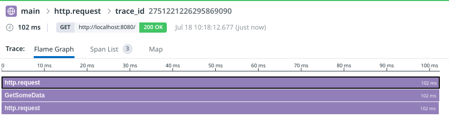

# Orchestrion

Automatic instrumentation of Go code


## Overview

Orchestrion processes Go source code and automatically inserts instrumentation.
This instrumentation creates Datadog APM traces for the instrumented code, but future work will include support for OpenTelemetry as well.

## Getting started

Orchestrion automatically adds instrumentation to your source code. This process saves time that engineers would have to spend manually adding the tracer and integrations by replacing that process with a single command.

There are a couple of ways to add instrumentation to your projects using Orchestrion. Orchestrion will also optionally (`-rm`) remove any instrumentation it has added, so this process is reversible.

### Instrument your code before check-in

The quickest way to instrument your code is to download and run Orchestrion on your development machine, and then check in the instrumented code. The executable(s) built with this instrumented code support tracing.


1. Install Orchestrion.

```sh
go install github.com/datadog/orchestrion@latest
```

2. Run Orchestrion to scan and rewrite the codebase.

```sh
## Go to your project root
cd ~/my_go_project

## Run orchestrion on the root directory. This will recursively instrument everything in the directory and its subdirectories.
orchestrion -w ./

## Build your project like normal. If you get errors here, you may need to tidy your go.mod file (go mod tidy)
go build <target>

## Congrats! You have a program with tracing automatically installed.
./<executable>
```

3. Check-in the modified code. You might need to run `go get github.com/datadog/orchestrion` and `go mod tidy` if it's the first time you add `orchestrion` to your Go project.

4. Deploy your service.

### Instrument your code at build time

It is also possible to instrument your code at build time. Instead of running Orchestrion on your machine and then checking in the code, you run Orchestrion in your build pipeline right before `go build`. 

1. Install Orchestrion in your build scripts/jobs.
```sh
go install github.com/datadog/orchestrion@latest
```

2. Run Orchestrion over your project before your compile step (`go build <target>`).
```sh
## This will recursively instrument everything in the directory (./) and its subdirectories.
orchestrion -w ./

go build <target>
```

3. Your build script should build a traced version of your project. You won't have to check in this code, so your codebase can remain untouched by tracing-specific code.

**Note**: It's a known issue that adding instrumentation at build time can alter the line numbers in your instrumented files. As a result, the line numbers in stack traces may differ from those in the checked-in code in your version control system.

## Example

### Starting code

Given a small `main.go` file, we can add instrumentation with one command.

`main.go`:
```go
package main

import (
	"context"
	"fmt"
	"io"
	"net/http"
	"strings"
	"time"
)

func main() {
	http.HandleFunc("/", func(writer http.ResponseWriter, request *http.Request) {
		data, err := GetSomeData(request.Context())
		if err != nil {
			http.Error(writer, fmt.Sprintf("Failed to get data: %v", err), http.StatusInternalServerError)
			return
		}
		writer.Write(data)
	})

	http.ListenAndServe(":8080", nil)
}

//dd:span my:tag
func GetSomeData(ctx context.Context) ([]byte, error) {
	client := &http.Client{
		Timeout: time.Second,
	}
	req, err := http.NewRequestWithContext(ctx,
		http.MethodPost, "http://example.com",
		strings.NewReader("Hello, World!"))
	if err != nil {
		return nil, err
	}
	resp, err := client.Do(req)
	if err != nil {
		return nil, err
	}
	fmt.Println(resp.Status)
	if resp.Body == nil {
		return nil, nil
	}
	defer resp.Body.Close()
	return io.ReadAll(resp.Body)
}
```

### Adding instrumentation
Run Orchestrion:
```
## in the directory with main.go
orchestrion -w ./
```

### Results

The `main.go` file has been modified with added instrumentation.

`main.go`:
```go
package main

import (
	"context"
	"fmt"
	"io"
	"net/http"
	"strings"
	"time"

	"github.com/datadog/orchestrion/instrument"
	"github.com/datadog/orchestrion/instrument/event"
)

func main() {
	//dd:startinstrument
	defer instrument.Init()()
	//dd:endinstrument
	//dd:startwrap
	http.HandleFunc("/", instrument.WrapHandlerFunc(func(writer http.ResponseWriter, request *http.Request) {
		data, err := GetSomeData(request.Context())
		if err != nil {
			http.Error(writer, fmt.Sprintf("Failed to get data: %v", err), http.StatusInternalServerError)
			return
		}
		writer.Write(data)
	}))
	//dd:endwrap

	http.ListenAndServe(":8080", nil)
}

//dd:span my:tag
func GetSomeData(ctx context.Context) ([]byte, error) {
	//dd:startinstrument
	ctx = instrument.Report(ctx, event.EventStart, "function-name", "GetSomeData", "my", "tag")
	defer instrument.Report(ctx, event.EventEnd, "function-name", "GetSomeData", "my", "tag")
	//dd:endinstrument
	//dd:startwrap
	client := instrument.WrapHTTPClient(&http.Client{
		Timeout: time.Second,
	})
	//dd:endwrap
	req, err := http.NewRequestWithContext(ctx,
		http.MethodPost, "http://example.com",
		strings.NewReader("Hello, World!"))
	if err != nil {
		return nil, err
	}
	resp, err := client.Do(req)
	if err != nil {
		return nil, err
	}
	fmt.Println(resp.Status)
	if resp.Body == nil {
		return nil, nil
	}
	defer resp.Body.Close()
	return io.ReadAll(resp.Body)
}

```

### Building

```
## You may need to tidy the go.mod file:
go mod tidy

## Then it can be built normally
go build main.go
```

And running it, we can see traces when the sample program receives requests.
```
./main
2023/07/18 10:13:28 Datadog Tracer v1.53.0-rc.1 INFO: DATADOG TRACER CONFIGURATION ...
```

In another terminal:
```
curl http://localhost:8080/
```

In the UI:



## Additional Examples

For a more complete, downloadable example including distributed traces between multiple services, please see our sample application here: [DataDog/go-sample-app][1].

## How it works

The source code package tree is scanned. For each source code file, `dave/dst` is used to build an AST of the source code in the file.

The AST is checked for package level functions or methods that have a `//dd:span` comment attached to them. A function or method annotated with `//dd:span` must have a `context.Context` as its first parameter, or an `*http.Request` as any parameter in order for a span to be automatically inserted into the code. The context or request is required for trace information to be passed through function calls in a Go program. If this condition is met, the `//dd:span` comment is scanned for tags and code is inserted as the first lines of the function.

Orchestrion also supports automatic tracing of the following libraries:

- [x] `net/http`
- [x] `database/sql`
- [x] `google.golang.org/grpc`
- [x] `github.com/gin-gonic/gin`
- [x] `github.com/labstack/echo/v4`
- [x] `https://github.com/go-chi/chi/v5`

Calls to these libraries are instrumented with library-specific code adding tracing to them, including support for distributed traces.

## Next steps

- [ ] Support compile-time auto-instrumentation via `-toolexec`
- [ ] Support auto-instrumenting more third-party libraries
- [ ] Support for OpenTelemetry

[1]: https://github.com/DataDog/go-sample-app
