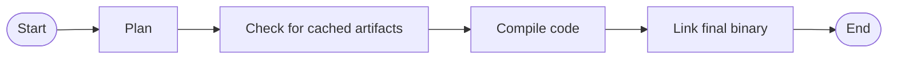

## The standard Go build process

Schematically, the standard toolchain's process for creating an executable (e.g,
to fulfill a `go build` command) is:



Specifically:
- During the **Plan** phase, the toolchain lists all Go packages that need to be
  compiled in order to build the final executable. It constructs a dependency
  tree from all necessary compilation units;
- It computes a _build ID_ for each package, based on the package's dependency
  tree as well as version information for all Go toolchain program used; and
  checks the `$GOCACHE` for already available objects matching these build IDs;
- It then proceeds to **Compile** anything that was not found in the `GOCACHE`,
  and then **Links** the final binary.

When computing _build IDs_, the Go toolchain invokes all required programs
with the `-V=full` argument, and factors the output into the _build ID_, so that
any change in a toolchain program results in invalidation of all cached outputs
from the previous version(s). The regular output of this looks something like
the following:
```console
$ go tool compile -V=full
compile version go1.22.5
$ go tool asm -V=full
asm version go1.22.5
```

Among other information, the _build IDs_ also factor in information about the
dependencies of the object, so that changing a package invalidates all its
dependents when relevant.

## Enter `orchestrion toolexec`

At the core, Orchestrion is interfacing with the standard Go toolchain using the
`-toolexec` mechanism:

> ```
> -toolexec 'cmd args'
> 	a program to use to invoke toolchain programs like vet and asm.
> 	For example, instead of running asm, the go command will run
> 	'cmd args /path/to/asm <arguments for asm>'.
> 	The TOOLEXEC_IMPORTPATH environment variable will be set,
> 	matching 'go list -f {{.ImportPath}}' for the package being built.
> ```

This mechanism allows `orchestrion` to integrate into the Go build process to
modify the source code about to be compiled. In particular:

- The `compile` command is provided all `.go` files that are compiled into the
  final executable; which `orchestrion` will modify to insert instrumentation
  code at all relevant places;
- The `link` command builds the final executable by linking together all the Go
  packages that contribute to the `main` entry point; to which `orchestrion`
  adds any library required by injected code that was not already present in the
  dependency tree.

### Integrating with `GOCACHE`

The attentive reader will have noticed that this means `orchestrion` changes the
dependency tree of packages being compiled by possibly adding new branches to
it; but the _build ID_ has already been calculated before `compile` and `link`
are involved... To properly integrate with the Go build artifact cache,
`orchestrion` intercepts the `-V=full` invocations of toolchain commands, and
appends versioning information including:
- its own version (a development build of `v0.7.2` in the example below)
- the transitive closure of packages it may inject (resulting in the hash listed
  after `injectables=` below)
- the checksum of the built-in injection rules (listef after `aspects=` below)

The Go toolchain expects a resulting string composed of three fields, so
Orchestrion composes into a rather long output:

```shell
$ orchestrion toolexec $(go env GOTOOLDIR)/compile -V=full
compile version go1.22.5:orchestrion@v0.7.2+MqXURZSvaKZl7setr4REn5Jn6AlQBABEe3QuUlyYTzW4yJ2XhUTMdsUnd1xjjnvTSxcV76mP7mquaAQCo7nwow==;injectables=lGUc8QV91HuOK1yWcSxkfmUFLQbKekTyy0eANpJE0rmeGmHR5D61VXn04/XX2kjuPbo8Nrdo+dFBmKPgpKV9jQ==;aspects=sha512:M1yO7gdlnh5Uy2ySDJZp1/QbFL97hY5HGKHYpIq2r561weEn4pAbseW7yBGNuQAP8lTpY4Id8M5jC1ItvVcj2w==
```

## Next


  

