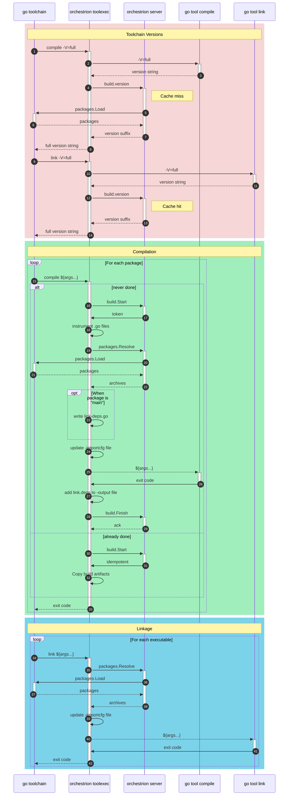

## How `orchestrion` works

Orchestrion leverages the standard Go toolchain's `-toolexec` flag to intercept
invocations to specific tools of the toolchain as part of the build:

1. Invocations of `go tool compile`
2. Invocations of `go tool link`

### Toolchain Versions

The standard Go toolchain invokes all tools involved in a given build with the
`-V=full` argument, so it can use all tool's versions as cache invalidation
inputs. In order to collaborate with the Go toolchain on `GOCACHE`, orchestrion
intercepts those for `go tool compile` and `go tool link` and modifies the
output so that it changes with:

- The version of orchestrion being used (different versions may apply
  integrations differently)
- The specific configuration being used (different integrations configured
  result in different instrumented code)
- The details about all packages that may be injected by the configured
  integrations (the Go toolchain is unaware of these dependencies, yet they
  affect the nature of the build output)
  * All relevant modules are listed using 

This results in more cache invalidations than is strictly necessary, however
the Go toolchain does not currently offer a more granual way to influence build
identifiers used for caching.

### Compilation

The standard Go toolchain makes one invocation to `go tool compile` for each
package being built (unless that particular package is already present in the
`GOCACHE`).

Orchestrion intercepts those commands and inspects all `.go` source files, and
replaces them with instrumented copies. Doing so implies:

1. Parsing all `.go` source files using 
2. Type-checking the resuling 
   * This requires reading type information from dependencies using the archives
     listed in the file specified by the `-importcfg` flag
3. Processing the  with the
   configured integrations
   * Modified copies of the files are written in the Go toolchain's working
     directory; and they include `//line` pragmas to retain the original file's
     line information
   * New compile-time dependencies may be introduced at this stage: integrations
     may inject new packages that are not part of the original build's closure,
     and the `-importcfg` file must provide an archive file for each imported
     package. Those dependencies are resolved using 
   * New link-time dependencies may be introduced at this stage (via
     `//go:linkname` pragmas), which must be recorded together with the
     package's build artifacts
4. When building a `main` package, a new source file is created that contains
   `import` statement for all link-time dependencies that were previously
   recorded and which are not present in the `-importcfg` file
   * This is necessary to ensure those package's `func init()` functions are
     correctly registered, and so that the Go toolchain presents those packages'
     archives to the linker
5. The `go tool compile` command is executed, using modified and synthetic `.go`
   source files and the modified `-importcfg` file
6. A `link.deps` file is added to the compiler-produced `.a` archive, listing
   all link-time dependencies implied by a dependency on this package. This is
   performed using `go tool pack`

### Link

The standard Go toolchain invokes `go tool link`  once for each executable
binary being produced. When using `go run` or `go build`, this is a single
invocation; hoever `go test` will invoke the linker once for each test package.

Orchestrion intercepts the linker commands to update the `-importcfg` file so
that it correctly lists all link-time dependencies introduced by instrumentation
of all linked packages. It uses  to retrieve the relevant archive files, and writes an updated `-importcfg`
file with all necessary additions performed.

## The job server

Due to the design of the Go toolchain's `-toolexec` feature, orchestrion works
by wrapping a large number of short-lived processes, which makes it difficult to
share state between individual processes.

Some of the work performed during instrumentation can however be expensive, and
we can preserve resources by making sure that work is done exactly once,
regardless of how many times it is required.

Orchestrion addresses this by starting a _job server_, which uses the
[NATS][nats] protocol and stays up for the entire duration of the build. That
server is responsible for the following aspects:

- Computing the version information that is appended to the output of
  intercepted `-V=full` invocations;
- Resolving package archives for injected dependencies, both during the
  `compile` and `link` phases of the build &ndash; these may cause child builds
  to be created;
- Storing `compile` task results in order to avoid having to re-instrument and
  re-compile packages that are both in the build's original dependency closure
  and part of some injected package dependencies.

[nats]: https://nats.io/
