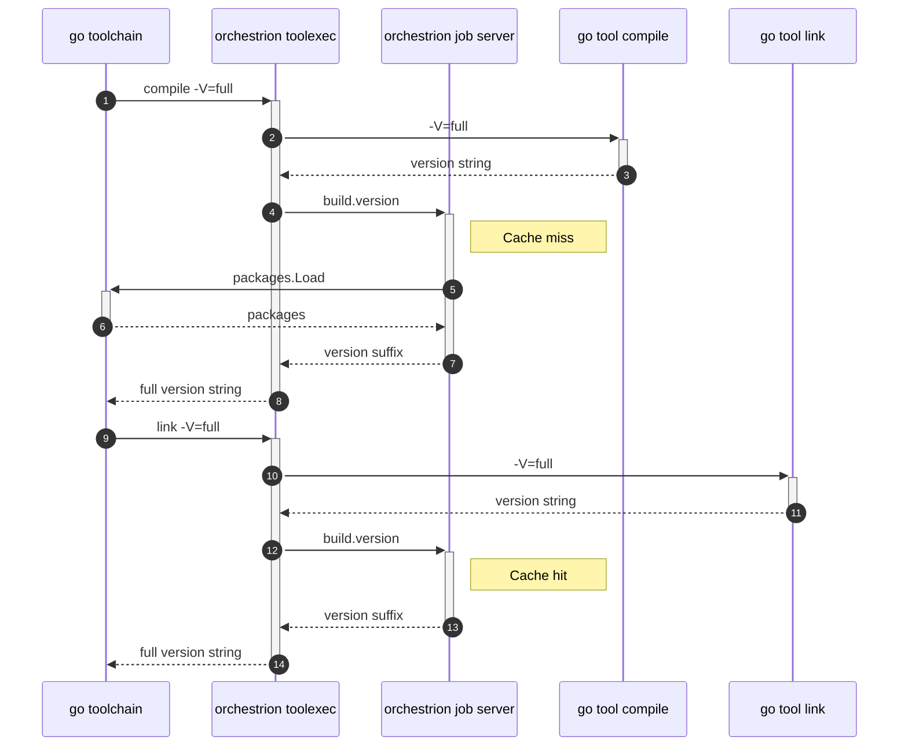
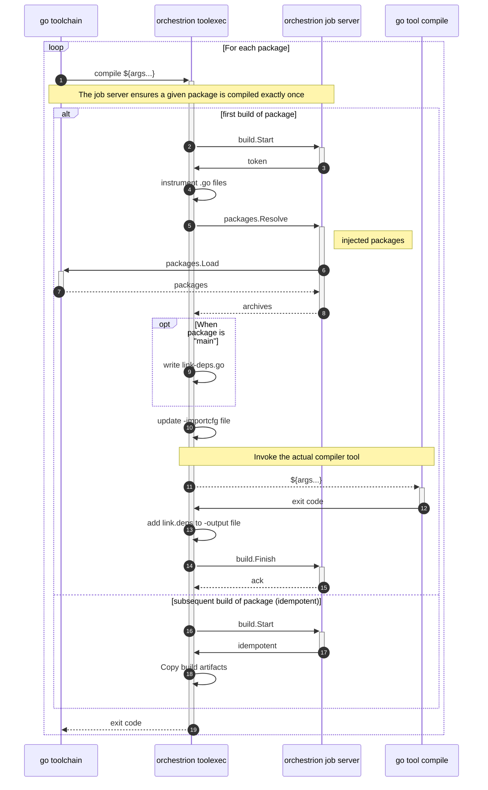
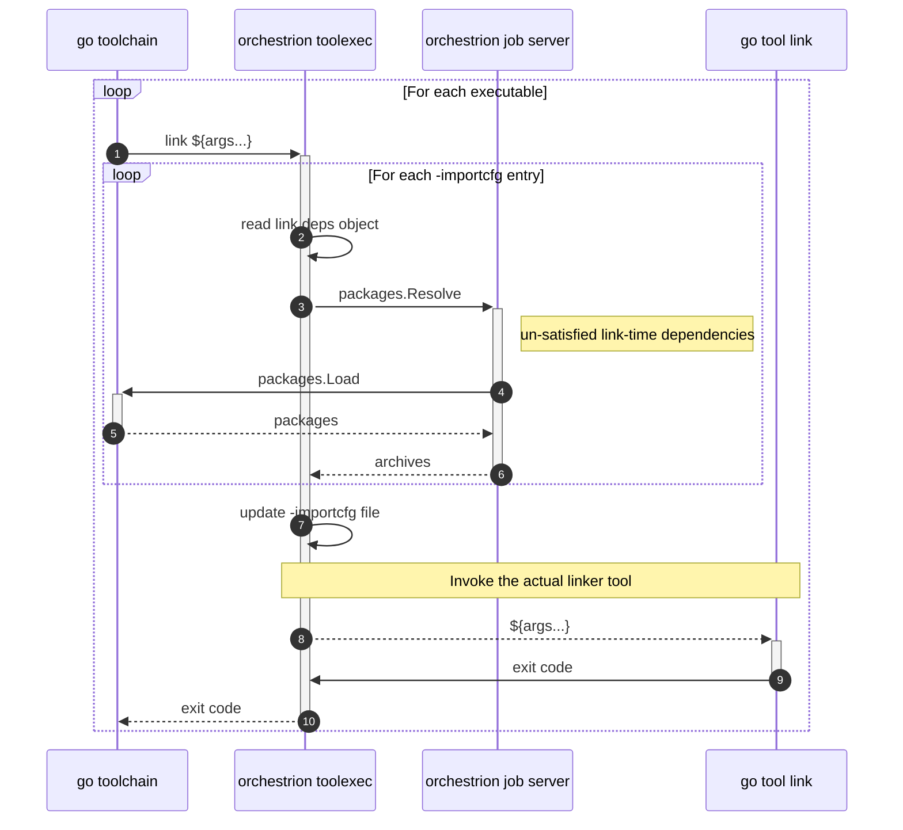

## How `orchestrion` works

Orchestrion leverages the standard Go toolchain's `-toolexec` flag to intercept
invocations to specific tools of the toolchain as part of the build:

1. Invocations of `go tool compile`
2. Invocations of `go tool link`

It uses a job server to ensure a given package is built exactly once, even if it
is a shared dependency between the instrumented application and some injected
packages. The job server also centralizes calls to  that resolve injected package's code objects, so that this somewhat
expensive process is done only once per package.

### Toolchain Versions

The standard Go toolchain invokes all tools involved in a given build with the
`-V=full` argument (①, ⑨), so it can use all tool's versions as build cache
invalidation inputs. Orchestrion intercepts those calls, and appends information
about itself to the results (④, ⑫). The version information added by
orchestrion changes:

<pre tabindex="0" class="chroma"><code class="language-console" data-lang="console">compile version go1.23.6:orchestrion@v1.1.0-rc.1;&lt;base64-encoded-hash&gt;</code></pre>

- the version of orchestrion being used, as different versions may apply
  integrations differently
- a base64-encoded hash composed using:
  - the specific configuration being used, as different integrations configured
    result in different instrumented code
  - the details about all packages that may be injected by the configured
    integrations, as the Go toolchain is unaware of these dependencies, yet
    they affect the nature of the build output
    * All relevant modules are listed using  (⑤), and the result is cached

This results in more cache invalidations than is strictly necessary, however
the Go toolchain does not currently offer a more granual way to influence build
identifiers used for caching.

### Compilation

The standard Go toolchain makes one invocation to `go tool compile` (①) for
each package being built (unless that particular package is already present in
the `GOCACHE`).

Orchestrion begins by registering the package build with the job server (②),
which will determine whether the build is new and should proceed (③); or if it
has already been done and should be re-used from cache (⑰).

When doing the first build of a package (④), orchestrion will:

- parse all `.go` source files using 
- type-check the 
   * this requires reading type information from dependencies using the archives
     listed in the file specified by the `-importcfg` flag
- processing the  with the
  configured integrations (they are decorated by )
  * Modified copies of the files are written in the Go toolchain's working
    directory; and they include `//line` pragmas to retain the original file's
    line information
  * New compile-time dependencies may be introduced at this stage: integrations
    may inject new packages that are not part of the original build's closure,
    and the `-importcfg` file must provide an archive file for each imported
    package. Those dependencies are resolved using  (⑥)
   * New link-time dependencies may be introduced at this stage (via
     `//go:linkname` pragmas), which must be recorded together with the
     package's build artifacts
* When building a `main` package, a new source file is created (⑨) that
  contains `import` statement for all link-time dependencies that were
  previously recorded and which are not present in the `-importcfg` file
  * This is necessary to ensure those package's `func init()` functions are
    correctly registered, and so that the Go toolchain presents those packages'
    archives to the linker
* The `go tool compile` command is executed (⑪), using modified and synthetic
  `.go` source files and the modified `-importcfg` file
* A `link.deps` file is added to the compiler-produced `.a` archive (⑬),
  listing all link-time dependencies implied by a dependency on this package.
  This is performed using `go tool pack`

Finally, the outcome of the build is registered with the job server (⑭),
unblocking concurrent attempts at building the same package.

### Link

The standard Go toolchain invokes `go tool link` (①) once for each executable
binary being produced. When using `go run` or `go build`, this is a single
invocation; hoever `go test` will invoke the linker once for each test package.

Orchestrion intercepts the linker commands to update the `-importcfg` file so
that it correctly lists all link-time dependencies introduced by instrumentation
of all linked packages (②). It uses  to locate the relevant archive files (④), and writes an updated
`-importcfg` file (⑦) with all necessary additions performed.

Finally, it invokes the `go tool link` with updated arguments (⑧).

## Code Injection

Orchestrion drives code injection using a process similar to classical
Aspect-oriented Programming (AoP) (see [Aspects][contrib-aspects]). These
combine a _Join Point_ (where code needs to be modified) with one or more
_Advices_ (what modifications need to be made).

In order to reduce the cost of evaluation () ships more than 100 different
aspects), we apply heuristics to determine what aspects have a chance of
applying to any given package and source file. The heuristics are based on the
observable dependency closure of the package being built (there is no need to
consider instrumentation targeting the `net/http` package if that package is not
imported) as well as the content of source files (an aspect that looks for the
`//dd:span` directive will never match in a source file that does not contain
any occurrence of this string).

The injector performs a depth-first traversal of the entire Abstract Syntax
Trees (ASTs), evaluates every applicable join point on each node; and applies
the configured advice where join points match.

[contrib-aspects]: ../../contributing/aspects/

## The job server

Due to the design of the Go toolchain's `-toolexec` feature, orchestrion works
by wrapping a large number of short-lived processes, which makes it difficult to
share state between individual processes.

Some of the work performed during instrumentation can however be expensive, and
we can preserve resources by making sure that work is done exactly once,
regardless of how many times it is required.

Orchestrion addresses this by starting a _job server_, which uses the
[NATS][nats] protocol and stays up for the entire duration of the build. That
server is responsible for the following aspects:

- Computing the version information that is appended to the output of
  intercepted `-V=full` invocations;
- Resolving package archives for injected dependencies, both during the
  `compile` and `link` phases of the build &ndash; these may cause child builds
  to be created;
- Storing `compile` task results in order to avoid having to re-instrument and
  re-compile packages that are both in the build's original dependency closure
  and part of some injected package dependencies.

[nats]: https://nats.io/
