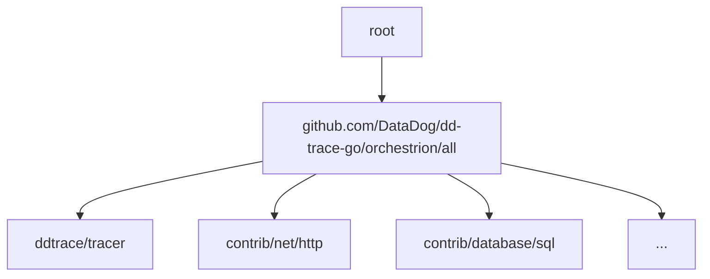

## Configuration

Orchestrion uses the file `orchestrion.tool.go` in the project root to imports its configuration. This file is
used to specify which integrations are enabled, and which features are activated but also as a way to connect
orchestrion integrations to your `go.mod` file to be able to version them.

The file is a Go source file, and it must be valid Go code. If your project does not already contain one, you may run
`orchestrion pin` to create it.


Orchestrion is a vendor-agnostic tool. By default, `orchestrion pin` enables Datadog's tracer integrations by
importing `github.com/DataDog/dd-trace-go/v2` in `orchestrion.tool.go`, but other vendors (such as OpenTelemetry) may
provide alternate integrations that can be used instead.


### Loading

Configuration is loaded from the `orchestrion.tool.go` alongside your `go.mod` file. Each import in this file
will be processed by orchestrion and will enable the corresponding integration. Configuration loading happens
recursively and will load all the integrations that are imported by `orchestrion.tool.go` in the imported package in a
tree-like structure.

Each package encountered in the configuration loading step is allowed to contain an `orchestrion.yml` file. These files
are the auto-instrumentation configuration backbone that modify your codebase. Please refer to the
[contributing guide][contributing] for more details on how to write these.

[contributing]: ../contributing/

### Finer grain instrumentation

The default `orchestrion.tool.go` imports all integrations provided by the `github.com/DataDog/dd-trace-go/v2`
repository. But this can be cumbersome if you only want to use a subset of the integrations. You can expand the default
`orchestrion.tool.go` by replacing the import of `github.com/DataDog/dd-trace-go/v2` with the specific integrations you
want to use from the list available at one level deeper in the configuration loading tree [here][orchestrion-all].

[orchestrion-all]: https://github.com/DataDog/dd-trace-go/blob/main/orchestrion/all/orchestrion.tool.go

### Remove an integration

Sometimes auto-instrumentation simply does not fit your use case. Plenty of automatic instrumentation modules offer more
configuration option when using their SDK. If you plan on using an SDK integration you should first remove the
corresponding import from `orchestrion.tool.go` and then use the SDK's own configuration mechanism to enable it. This
may require you to opt for finer grain instrumentation like described in the previous section.


Some auto instrumentation integrations (notably caller-side) may automatically be neutered by using the corresponding
manual instrumentation but this is not guaranteed. If you are using manual instrumentation, and you want to ensure that
2 similar spans are not created, you should remove the corresponding import from `orchestrion.tool.go`.

